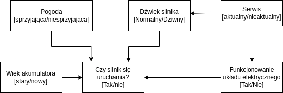

# WSI 2023 LAB7 - Sieci bayesowskie
### Maksym Bieńkowski

# Zawartość archiwum
### `/src`
* `probs.py` - tablice prawdopodobieństw dla wszystkich zmiennych
* `network.py` - sieć bayesowska zaciągająca prawdopodobieństwa z `probs.py`
* `enums.py` - enumy opisujące możliwe stany każdego z elementów sieci
* `experiments.py` - zawiera część zadania związaną z przeprowadzaniem eksperymentów z wykorzystaniem sieci

## Uruchamialne skrypty
### `main.py`
przyjmuje następujące parametry: 

Wszystkie argumenty mają domyślne wartości, więc możemy uruchomić skrypt poprzez
```shell
```
lub, określając argumenty:
```shell
```
## Krótki opis rozwiązania
Sieć bayesowska służąca do diagnostyki problemów z uruchamianiem silnika samochodu lub wyznaczania prawdopodobieństwa
jego poprawnego uruchomienia na podstawie kilku czynników, m. in stanu układu elektrycznego, pogody czy dźwięku 
wydawanego przez silnik. 

Diagram sieci:



Po więcej szczegółów zapraszam do sprawozdania.
